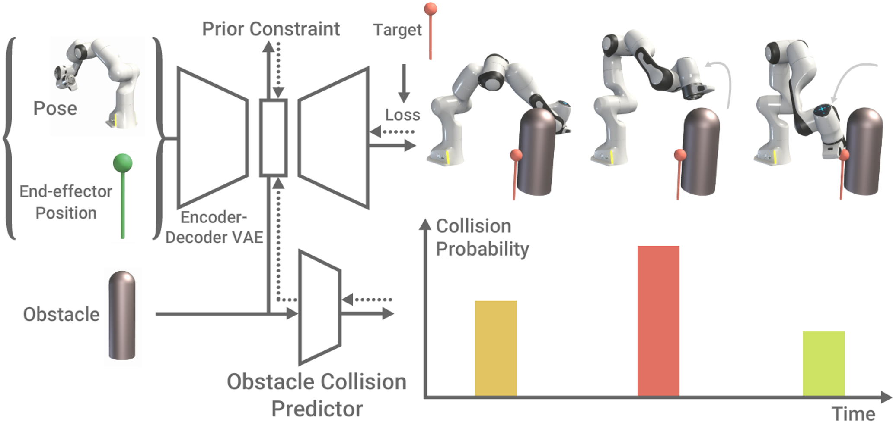

# Reaching Through Latent Space



This repository contains the non-official implementation of [Reaching Through Latent Space: From joint statistics to path planning in manipulation](https://arxiv.org/abs/2210.11779).

Hung, C. M., Zhong, S., Goodwin, W., Jones, O. P., Engelcke, M., Havoutis, I., & Posner, I. (2022). Reaching through latent space: From joint statistics to path planning in manipulation. IEEE Robotics and Automation Letters, 7(2), 5334-5341.

If you use our models, datasets or simulation environments in your work, please cite our work as:
```
@article{hung2022reaching,
  title={Reaching Through Latent Space: From Joint Statistics to Path Planning in Manipulation},
  author={Hung, Chia-Man and Zhong, Shaohong and Goodwin, Walter and Jones, Oiwi Parker and Engelcke, Martin and Havoutis, Ioannis and Posner, Ingmar},
  journal={IEEE Robotics and Automation Letters},
  volume={7},
  number={2},
  pages={5334--5341},
  year={2022},
  publisher={IEEE}
}
```

Project page: https://ascane.github.io/projects/20_lspp/index.html

## Environment Setup

1. [Build a virtual environment using Python 3](https://docs.python.org/3/library/venv.html) and install all the requirements.

    ```
    $ python3 -m venv /path/to/new/virtual/environment
    $ source venv/bin/activate
    (venv) $ pip install -r requirements.txt
    ```

2. Set PYTHONPATH and RTLS_DATA.

    ```
    (venv) $ PYTHONPATH=/<my_dir>/reaching-through-latent-space/src
    (venv) $ RTLS_DATA=/<my_dir>/reaching-through-latent-space/data
    ```

    Or add the following direclty in your virtual environment `venv/bin/activate`.

    ```
    RTLS_ROOT=/<my_dir>/reaching-through-latent-space
    RTLS_SRC=${RTLS_ROOT}/src
    RTLS_DATA=${RTLS_ROOT}/data

    export PYTHONPATH=${PYTHONPATH}:${RTLS_SRC}
    export RTLS_DATA=${RTLS_DATA}
    ```

## Model Training

### Training a VAE model

1. Create a yaml config file (e.g. `config/vae_config/panda_10k.yaml`).

   An example file already exists, but `path_to_dataset` and `model_dir` need to be modified.

2. Launch VAE training using `train_vae.py`.

    ```
    (venv) $ cd reaching-through-latent-space/src
    (venv) $ python train_vae.py --c ../config/vae_config/panda_10k.yaml
    ```

### Training a VAE Obstacle Classifier model

1. Create a yaml config file (e.g. `config/vae_obs_config/panda_10k.yaml`).

   An example file already exists, but `path_to_dataset`, `vae_run_cmd_path`, `pretrained_checkpoint_path`, and `model_dir` need to be modified.

2. Launch obstacle classifier training using `train_vae_obs.py`.

    ```
    (venv) $ cd reaching-through-latent-space/src
    (venv) $ python train_vae_obs.py --c ../config/vae_obs_config/panda_10k.yaml
    ```

## Acknowledgements

This work was supported by the UKRI/EPSRC Programme Grant [EP/V000748/1], NIA [EP/S002383/1], the RAIN [EP/R026084/1] and ORCA [EP/R026173/1] Hubs, the Clarendon Fund and Amazon Web Services as part of the Human-Machine Collaboration Programme. The authors also gratefully acknowledge the use of the University of Oxford Advanced Research Computing (ARC) facility in carrying out this work (http://dx.doi.org/10.5281/zenodo.22558) and the use of Hartree Centre resources. We thank Jonathan Gammell for insightful feedback and discussions, and Rowan Border for helping with setting up BIT* and interfacing between OMPL and MoveIt. We also thank Yizhe Wu for recording real-world experiments, and Jack Collins for proofreading our work.
